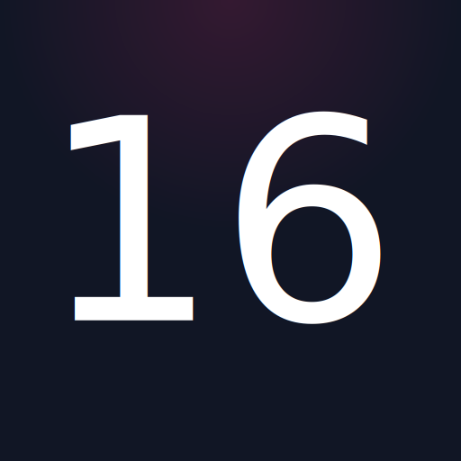

<!-- Project Header -->

  

  <h1 class="projectName">
    <a href="https://168421.xyz">168421.xyz</a>
  </h1>

  

    
    
    
    
  

  
  

    A simple placeholder/cover page for 168421.xyz
  

  
   

## License
This project is licensed under the MIT License. See [LICENSE](LICENSE) for details.
