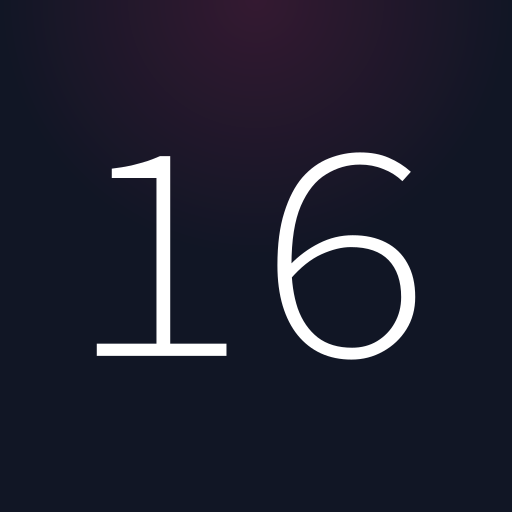

<!-- Project Header -->

  
  <h1 class="projectName">
    <a href="https://168421.xyz">168421.xyz</a>
  </h1>
  

    
    
    
    
    
  

  

    A simple placeholder/cover page for 168421.xyz
  

   

## 🧾 License
This project is licensed under the MIT License. See [LICENSE](LICENSE) for details.

## 💕 Funding

Find this project useful? [Sponsoring me](https://johng.io/funding) will help me cover costs and **_commit_** more time to open-source.

If you can't donate but still want to contribute, don't worry. There are many other ways to help out, like:

- 📢 reporting (submitting feature requests & bug reports)
- 👨‍💻 coding (implementing features & fixing bugs)
- 📝 writing (documenting & translating)
- 💬 spreading the word
- ⭐ starring the project

I appreciate the support!
